# ✨ApoGalleria - Visual Aesthetics Library  Ideo4✨

### **ApoGalleria** is my powerful custom node suite designed for inspiration on tap. Generate images from a stored library of reference image/JSON captioned pairs. Real-time importing, viewing, and editing of captions right within ComfyUI. Coded specifically for Ideo4, and captioned in Ideo4 structured JSON. 
My sibling nodes convert Ideo4 JSON captions on the fly for inference across multiple model architectures. 

To satiate my new custom nodes I also built a colossal **[Visual Aesthetics Library](https://github.com/ApoloniArt/Visual-Aesthetics-Library)** that contains over 60,000+ pieces of captioned art inspiration, available directly from me. Both are personal projects created to fill my exact needs.

---

## ApoGalleria-Ideo4
### **<ins>My core node:</ins>** 

**`ApoGalleria - Visual Aesthetics Library Ideo4`** 

Build up your own libraries of image/JSON pairs, browse them in a split gallery + field-editor UI, lock the fields you like, mix-and-match across multiple saved entries, and
pass the finished JSON straight into **Kijai's Ideogram 4 Prompt Builder** node's `import_json` input via this node's `export_json` output.

**Split UI:**
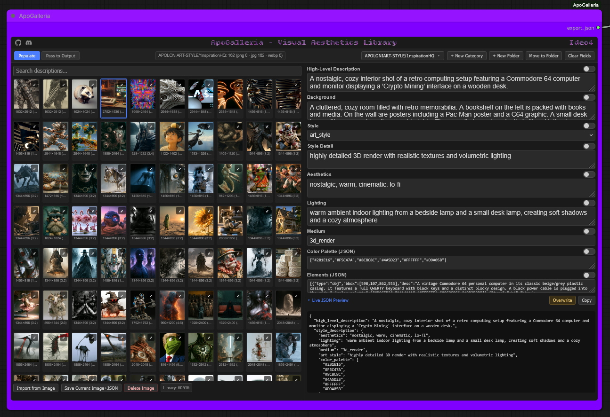

- **Left (Populate mode):** grid gallery of stored images, searchable by
  description, with a nested folder-tree category picker (create categories
  and grouping folders on the fly, rename/move/delete from the same flyout).
  
- **Right:** editable natural-language fields — `high_level_description`,
  `background`, `style` (photo / art_style), the matching `style detail` text,
  `aesthetics`, `lighting`, `medium`, and the raw `color_palette` / `elements`
  JSON blobs.

**Field locking:** every field has its own lock toggle. Locked fields hold
their value no matter which library image you click next — so you can graze
across several saved entries, locking one good field at a time, to build a
unique combined description.

### **<ins>Mode toggle:</ins>**

- `Populate` — Library is active; selecting an entry fills all *unlocked*
  fields.
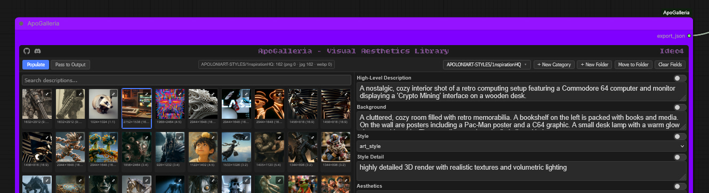

- `Pass to Output` — Library is disabled; the current field state (locked +
  unlocked mix, plus any manual edits) is assembled into the full schema and
  emitted on the `export_json` output.
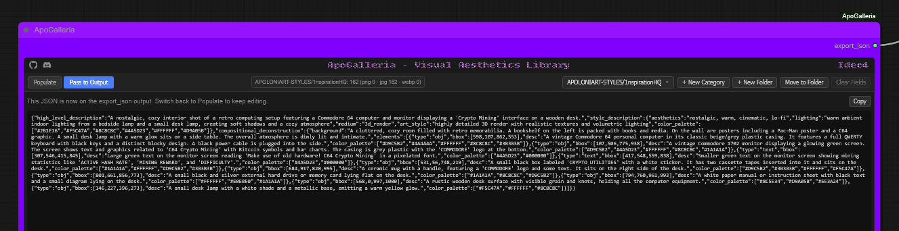

### **<ins>Importing into the library:</ins>**

Using ApoGalleria-Ideo4 to import images directly:
1. [PNG] Select `Import from Image` select your desired PNG generated by your Ideogram 4 pipeline, select `Save Current Image + JSON` and **ApoGalleria-Ideo4** will save the image to the library in the current selected folder, and pull the embedded description metadata straight out of it creating a sidecar JSON file — no manual JSON authoring needed.

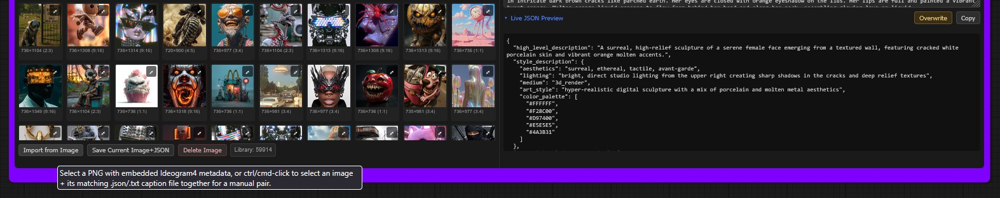
2. [JPG/WEBP] Require a pre-captioned JSON/txt sidecar file alongside the image. The process to save to the library is as above, but both image and JSON/txt files must be selected and saved together.
### 3. Drop your folders of Image/caption pairs straight into the main library directory to create your collections quickly.
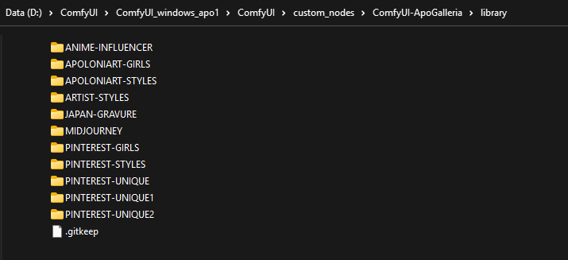

---

### **<ins>Live editing & Overwriting:</ins>**

You can edit any loaded JSON caption in real-time, in node. Once you are happy with the finished description you can either pass to output for inference, 1-click copy the JSON for a manual file save, or you can choose to overwrite the existing JSON/txt file. This is extremely helpful for tweaking JSON/txt captions that are slightly off, correcting little descriptive anomalies, or changing things to suit your needs.

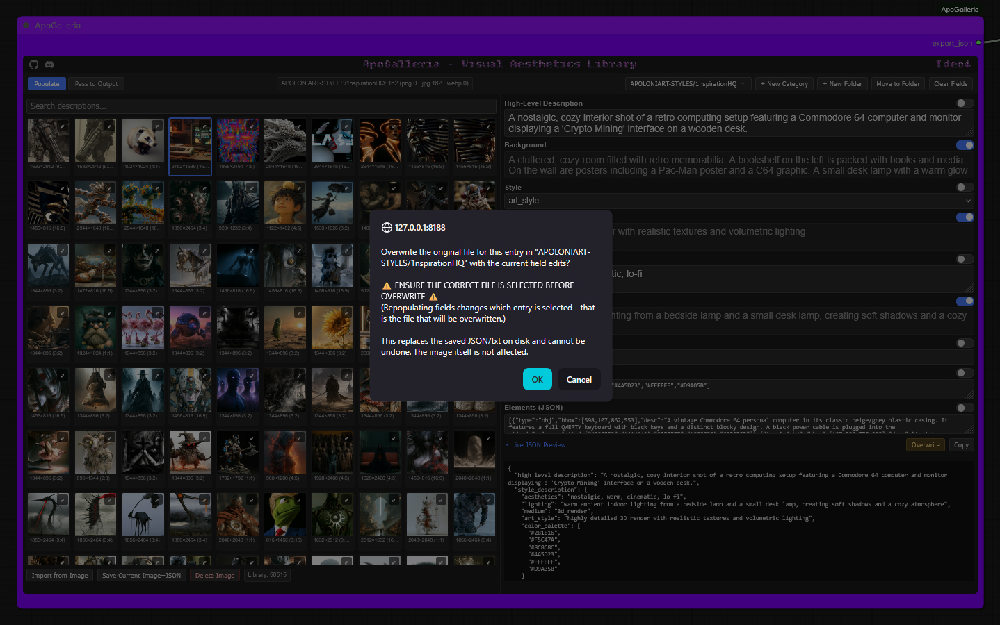
If you choose to overwrite the existing JSON/txt caption, you will be presented with a safety verification warning to avoid accidental overwrite. 
It informs you that the current selected image is the file which will be overwritten, this is **very important** to confirm, especially when mixing and compiling unique descriptions from multiple library image/captions.

### Schema

```json
{
  "high_level_description": "string",
  "style_description": {
    "style": "photo | art_style",
    "photo": "string",         // present when style == photo
    "art_style": "string",     // present when style == art_style
    "aesthetics": "string",
    "lighting": "string",
    "medium": "string",
    "color_palette": ["#hex", "..."]
  },
  "compositional_deconstruction": {
    "background": "string",
    "elements": [
      {
        "type": "obj | text",
        "bbox": [0, 0, 0, 0],   // [ymin, xmin, ymax, xmax] on a 0-1000 grid
        "desc": "string",
        "text": "string",          // optional, for type == text
        "color_palette": ["#hex", "..."]  // optional, per-element
      }
    ]
  }
}
```

### Storage

Image/caption pairs live under `library/<category>/<entry_id>.<ext>` +
`library/<category>/<entry_id>.json` (or `.txt`, fully equivalent) inside
this node's own `library/` directory. Categories are leaf folders that hold
entries; grouping folders hold only subfolders, never entries — both are
managed from the flyout picker in the node UI.

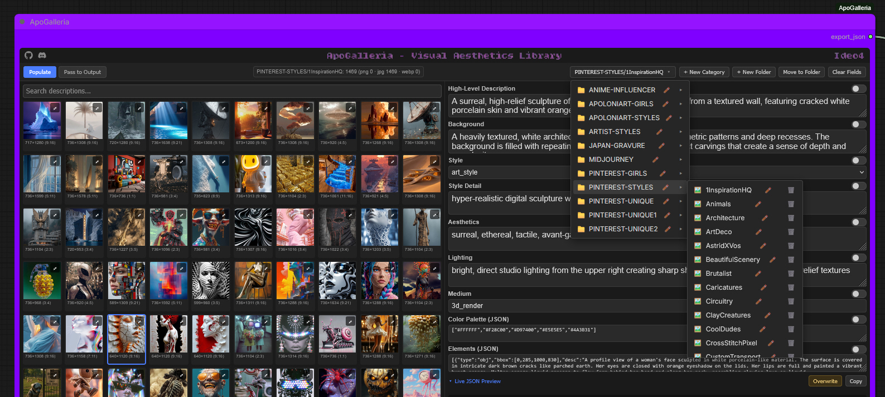
**Never delete or replace the `library/` folder wholesale — this is where
your saved image/caption pairs live.**

---

## ApoGalleria-Flux2

A sibling converter node. Takes the `export_json` output from
**ApoGalleria-Ideo4** and converts it on the fly into Flux.2's structured
JSON prompt schema, ready to feed into Flux.2 conditioning.

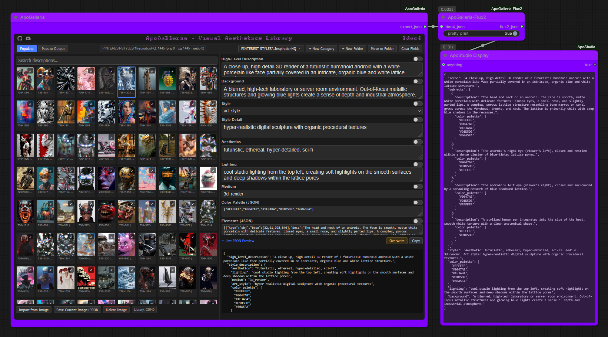

This node has no UI, no storage, and no library of its own — it's a pure
passthrough-transform.

```
ApoGalleria-Ideo4 (export_json) --> ApoGalleria-Flux2 (ideo4_json)
                                          |
                                          v
                                     flux2_json --> [your Flux.2 conditioning]
```

**Inputs:**
- `ideo4_json` (STRING, required) — the `export_json` string from ApoGalleria-Ideo4
- `pretty_print` (BOOLEAN, optional, default `True`) — indent the output JSON

**Output:**
- `flux2_json` (STRING) — Flux.2-structured JSON prompt

### Schema mapping

Flux.2's structured-prompt schema (per Black Forest Labs' official prompting
guide) is flatter and more loosely typed than Ideogram 4's strict nested
schema — no bounding-box/coordinate concept, and no `art_style`/`photo`
mutual exclusivity concept.

| Ideo4 field | → | Flux2 field |
|---|---|---|
| `high_level_description` | → | `scene` |
| `style_description.aesthetics` | → | folded into `style` ("Aesthetic: ...") |
| `style_description.medium` | → | folded into `style` ("Medium: ...") |
| `style_description.art_style` *or* `.photo` | → | folded into `style` ("Art style: ..." / "Photo style: ...") |
| `style_description.lighting` | → | `lighting` |
| `style_description.color_palette` | → | `color_palette` |
| `compositional_deconstruction.background` | → | `background` |
| `compositional_deconstruction.elements[].desc` | → | `subjects[].description` |
| `compositional_deconstruction.elements[].bbox` | → | *dropped* — no plain-English position is fabricated |
| `compositional_deconstruction.elements[].text` | → | `subjects[].text` (only if present on the source) |
| `compositional_deconstruction.elements[].color_palette` | → | `subjects[].color_palette` (only if present on the source) |
| *(no Ideo4 source)* | → | `mood`, `composition`, `camera` — omitted entirely, never fabricated |

If a field has no value in the source, it is left out of the output rather
than written as an empty string or `null`.

---

## ApoGalleria-NL

A shared sibling converter node. Takes the `export_json` output from
**ApoGalleria-Ideo4** and composes it into a single natural-language
paragraph, for architectures that prompt with descriptive prose rather than
a structured schema.

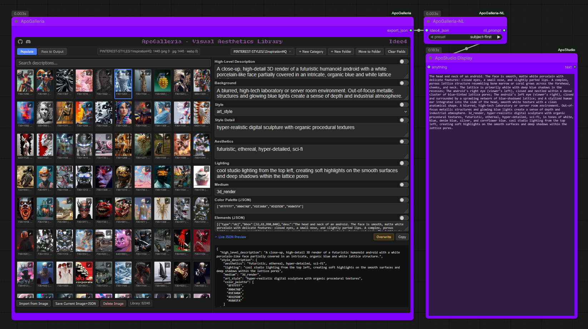

### Covers

- **Z-Image Turbo** | **Krea2** | **Qwen-Image** | **Flux (1)** | **WAN 2.2** | **Magic WAN**
- **Flux2**, when used in its natural-language prompting mode (as opposed
  to Flux2's JSON mode, which ApoGalleria-Flux2 handles separately)

These architectures all share the same target format — flowing, descriptive
sentences, not comma-separated tags and not a JSON structure — so one
shared converter serves all of them rather than building five nearly
identical nodes.

Like ApoGalleria-Flux2, this node has no UI, no storage, and no library of
its own. It's a pure passthrough-transform.

```
ApoGalleria-Ideo4 (export_json) --> ApoGalleria-NL (ideo4_json)
                                          |
                                          v
                                     nl_prompt --> [your text encoder / CLIP node]
```

**Inputs:**
- `ideo4_json` (STRING, required) — the `export_json` string from ApoGalleria-Ideo4
- `preset` (dropdown, required) — `subject-first` (default) or `scene-first`

**Output:**
- `nl_prompt` (STRING) — a single flowing natural-language paragraph

### Dual Ordering presets

<ins>This node has two presets</ins>: Both carry the same underlying detail and end the same way, in
style then lighting — they differ in narrative shape, not just which
sentence leads:

- **subject-first** *(default)*: opens with the people/objects in the image
  as one flat listed clause, then background, then style, then lighting.
- **scene-first**: establishes the scene first (overall description, then
  background), then places the subject(s) *within* that already-established
  setting ("Within this setting, a young woman..."), then style, then
  lighting — a genuinely different narrative flow, not a reordering of the
  same flat clauses.

Try both against the same caption — which reads better tends to depend on
whether the image is more about an overall scene or a specific subject.
Basically like an extra seed, great for experimenting and variation!

### Color palette handling

Ideo4 captions store `color_palette` as hex codes, which don't read
naturally in prose. This node resolves each hex value to its nearest named
color (e.g. `#F4E1C1` → "warm cream") and folds them into a clause like
*"in tones of warm cream, sage green, and burnt terracotta."* Hex values
never appear directly in the output.

### Schema mapping

| Ideo4 field | → | Role in the paragraph |
|---|---|---|
| `high_level_description` | → | opening sentence in `scene-first`; not used in `subject-first` |
| `compositional_deconstruction.elements[].desc` | → | opening clause in `subject-first` (flat list); "placed within the scene" clause in `scene-first` |
| `compositional_deconstruction.elements[].text` | → | folded into that element's clause as `the text "…" is visible [in the <position>]` — casing preserved exactly as written in the source, never altered |
| `compositional_deconstruction.elements[].bbox` | → | used only to derive the `text` clause's position phrase above (e.g. "upper-left", "centered"); omitted entirely — never guessed — when bbox is missing or malformed |
| `compositional_deconstruction.background` | → | second sentence, both presets |
| `style_description.medium` | → | folded into the style sentence |
| `style_description.art_style` *or* `.photo` | → | folded into the style sentence |
| `style_description.aesthetics` | → | folded into the style sentence |
| `style_description.color_palette` | → | folded into the style sentence, as a named-color clause |
| `style_description.lighting` | → | closing sentence, both presets |

Missing fields are simply skipped — nothing is fabricated to fill a gap.

---

## Ideo4 Ground Truth & conversion node output examples
All comparison examples were run from the same Ideo4 image/caption, with a locked seed.
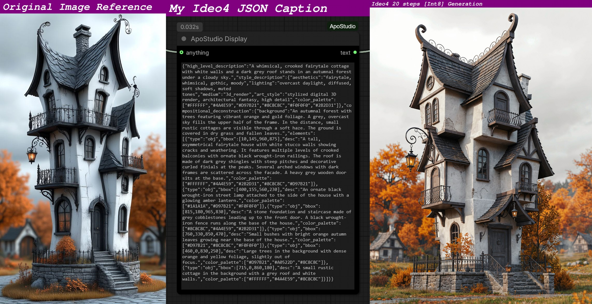

## Flux1-DEV
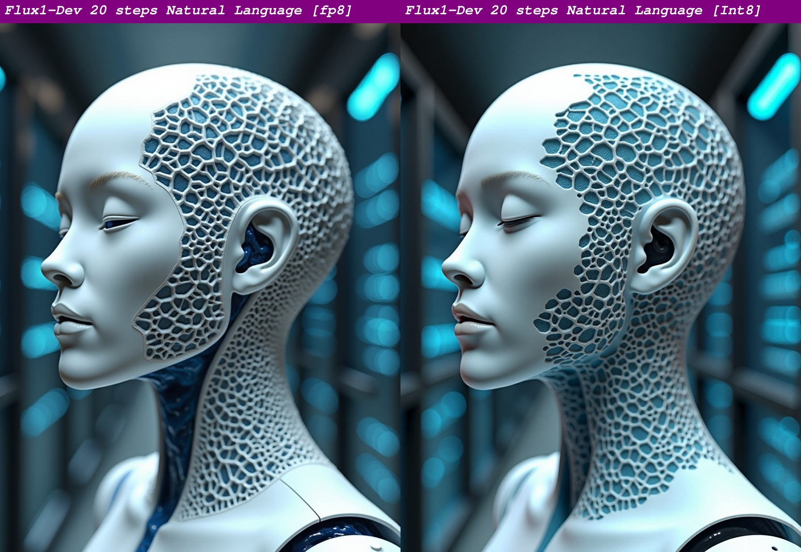

## Flux2-DEV
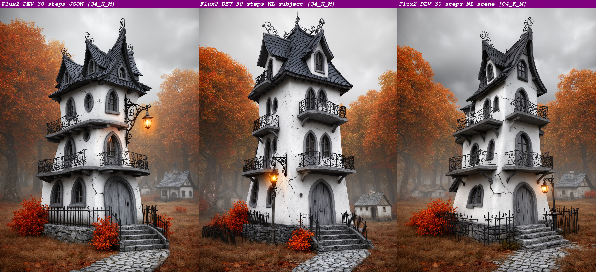

## Z-Image Turbo
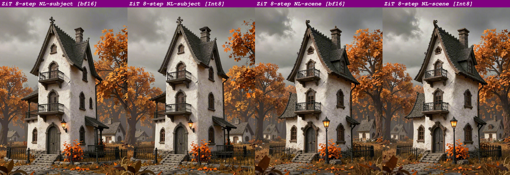

## WAN 2.2 & Magic WAN
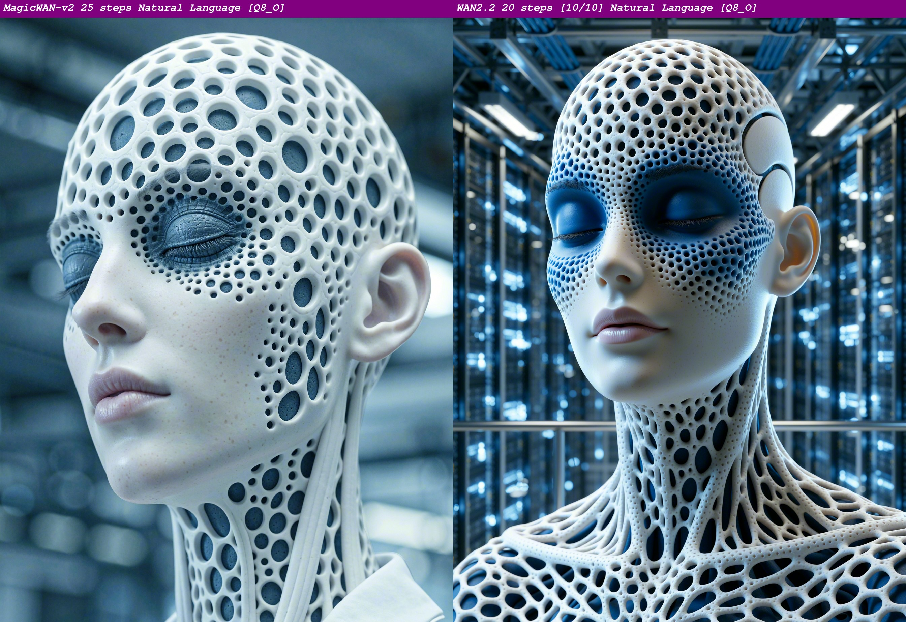
Proof of concept examples for the architectures I currently have.

## Installation

1. Clone into your ComfyUI custom_nodes folder:
   ```bash
   cd ComfyUI/custom_nodes
   git clone https://github.com/ApoloniArt/ApoGalleria ComfyUI-ApoGalleria
   ```
2. Install dependencies:
   ```bash
   # Windows portable:
   python -m pip install -r ComfyUI-ApoGalleria\requirements.txt

   # Standard install:
   pip install -r ComfyUI-ApoGalleria\requirements.txt
   ```  
3. Restart ComfyUI.
4. All three nodes appear under the **ApoGalleria** category in the node
   menu: **ApoGalleria-Ideo4**, **ApoGalleria-Flux2**, **ApoGalleria-NL**.
   
5. Updating my nodes:
 ```bash
   cd ComfyUI/custom_nodes/ComfyUI-ApoGalleria
   git pull
   ```

## Typical workflow

```
                                  +--> ApoGalleria-Flux2 --> flux2_json
                                  |
ApoGalleria-Ideo4 --(export_json)-+
                                  |
                                  +--> ApoGalleria-NL --> nl_prompt
```

Build and curate your caption library once in ApoGalleria-Ideo4, then wire
its `export_json` output directly to Ideo4, or whichever sibling node matches your target
model — or both at once, if you generate across multiple architectures
from the same library.

# Visual Aesthetics Library

Looking for a ready-made reference library to drop into ApoGalleria-Ideo4?
See my **[Visual Aesthetics Library](https://github.com/ApoloniArt/Visual-Aesthetics-Library)** for a colossal
60,000+ image/caption reference library.

## Available directly from me via my Discord 👉 [ApoloniArt](https://discord.gg/XDExAUzuZp) 👈

---

## Unavoidable Annoyance & Comfy Anomalies
Display/operational disparity between normal ComfyUI and Nodes 2.0 *sigh* 😔
[My nodes function perfectly in both, but due to Nodes 2.0 being a pain in the ass to code for, there are differences in display & operation]
I tend to switch between both depending on how I feel...but I think I prefer non-Nodes 2.0.
**Normal Comfy mode:** Scrolling in-node works better but visuals disappear when you zoom out {no idea why that now happens, I'm sure it wasn't like that before] 

**Nodes 2.0 mode:** Scrolling is manual by bar, visuals do not disappear when zooming out.

#### TIP: Spawn my main node, select an image, then click on Live JSON Preview. Doing this will keep the node to it's minimal size and not require manual resizing time and again. If you resize my node before opening Live JSON Preview you'll keep resizing it back down. Just an annoying little display issue that doesn't really bother me 🤷‍♀️

---

## Changelog

### v1.0.2 — 2026-09-09
- **Fixed:** ApoGalleria-NL silently dropped any `elements[].text` field from
  the source Ideo4 JSON, so images with on-image text (signs, titles,
  labels) rendered without that text at all. Text is now correctly folded
  into the generated prose as `the text "…" is visible [in the <position>]`.
  - Casing is preserved exactly as written in the source (never lowercased
    or otherwise altered) — rendered text needs its literal casing to
    produce the correct visual.
  - Placement is derived from the element's real `bbox` coordinates when
    present (translated into a coarse position like "upper-left" or
    "centered") and simply omitted — never guessed — when `bbox` is
    missing or malformed.
  - Applies to both ordering presets (`subject-first` and `scene-first`).

### v1.0.1 — 2026-09-09
- **Fixed:** the logo header font (Bitcount Ink) failed to load on current
  ComfyUI frontend versions, silently falling back to a plain system font.
  Root cause: newer ComfyUI frontends enforce a strict default Content
  Security Policy that blocks any cross-origin font/stylesheet request,
  including the previous `fonts.googleapis.com` link. The font is now
  self-hosted and served same-origin via a dedicated backend route
  (`/apogalleria/font/…`), matching the same explicit-Content-Type pattern
  already used for serving the widget's JS.

---

*Made with love by [ApoloniArt](https://github.com/ApoloniArt) because I wanted inspiration on tap.* With **ApoGalleria** and <ins>Visual Aesthetics Library</ins>, I never have to worry again.
Neither will you 💜
Questions, feedback, or requests? Hit me up, I'm very friendly 😘
